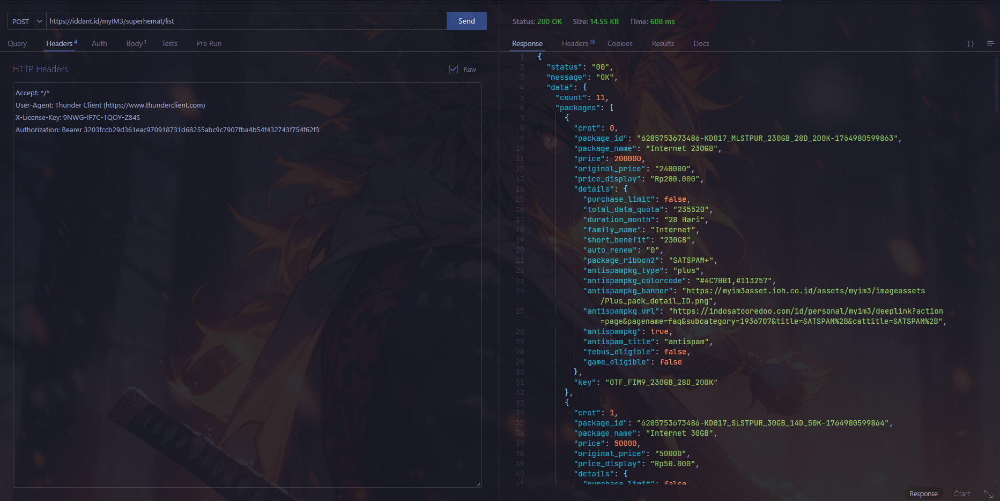

# myIM3 REST API  
> **Unofficial REST API Wrapper** for myIM3  

<p align="left">
  
  
  
  
</p>

---

<center></center>

## 📌 Ringkasan Endpoint  
Semua endpoint menggunakan **POST**.

| Endpoint           | Deskripsi                                 | Token |
|--------------------|-------------------------------------------|-------|
| `/send`            | Mengirim OTP ke nomor pengguna            | ❌    |
| `/verify`          | Memverifikasi OTP & mendapatkan token     | ❌    |
| `/dashboard`       | Mengambil data dashboard pengguna         | ✅    |
| `/superhemat/list` | Mengambil data list package               | ✅    |
| `/superhemat`      | Buy Package                               | ✅    |
| `/plus/list`       | Mengambil data list package               | ✅    |
| `/plus`            | Buy Package                               | ✅    |
| `/freedom/list`    | Mengambil data list package               | ✅    |
| `/freedom`         | Buy Package                               | ✅    |
| `/offer/list`      | Mengambil data list package               | ✅    |
| `/offer`           | Buy Package                               | ✅    |
| `/promo/list`      | Mengambil data list package               | ✅    |
| `/promo`           | Buy Package                               | ✅    |

---

## 📌 Payment Method  
| No | Payment    | Status |
|----|------------|------- |
| 1  | `DANA`       | ✅    |
| 2  | `SHOPEEPAY`  | ✅    |
| 3  | `OVO`        | ✅    |
| 4  | `GOPAY`      | ✅    |
| 5  | `QRIS`       | ✅    |

---

## 🔐 Header Wajib
```text
BASE = https://iddant.id/myIM3
X-License-Key: <your_license_key>
Authorization: Bearer <token>
Content-Type: application/json

$LIC  = 9NWG-IF7C-1QOY-Z84S
$AUTH = 3203fccb29d361eac970918731d68255abc9c7907fba4b54f432743f754f62f3
```

## 🚀 1. /send
```bash
curl -X POST "$BASE/send" \
  -H "Content-Type: application/json" \
  -H "X-License-Key: $LIC" \
  -H "Authorization: $AUTH" \
  -d '{"phone":"8123456789"}'
```

## 🚀 2. /verify
```bash
curl -X POST "$BASE/verify" \
  -H "Content-Type: application/json" \
  -H "X-License-Key: $LIC" \
  -H "Authorization: $AUTH" \
  -d '{"transid":"TRANSID_FROM_SEND","otp":"123456"}'
```

## 🚀 3. /dashboard
```bash
curl -X POST "$BASE/dashboard" \
  -H "Content-Type: application/json" \
  -H "X-License-Key: $LIC" \
  -H "Authorization: $AUTH" \
  -d '{"token":"TOKEN_FROM_VERIFY"}'
```

## 🚀 4. /superhemat/list
```bash
curl -X POST "$BASE/superhemat/list" \
  -H "Content-Type: application/json" \
  -H "X-License-Key: $LIC" \
  -H "Authorization: $AUTH" \
  -d '{"token":"TOKEN"}'
```

## 🚀 5. /superhemat
```bash
curl -X POST "$BASE/superhemat" \
  -H "Content-Type: application/json" \
  -H "X-License-Key: $LIC" \
  -H "Authorization: $AUTH" \
  -d '{"token":"TOKEN","package_id":0,"payment_method":"QRIS"}'
```

## Example
```php
$LIC  = "9NWG-IF7C-1QOY-Z84S";
$AUTH = "3203fccb29d361eac970918731d68255abc9c7907fba4b54f432743f754f62f3";

$api = new MyIM3Api($LIC, $AUTH);

// 1. Kirim OTP
$response = $api->sendOTP("8123456789");
echo $response;

// Misalkan hasil sendOTP memberikan TRANSID
$transid = "TRANSID_FROM_SEND";

// 2. Verifikasi OTP
$response = $api->verifyOTP($transid, "123456");
echo $response;

// Misalkan verify menghasilkan TOKEN:
$token = "TOKEN_FROM_VERIFY";

// 3. Dashboard
echo $api->dashboard($token);

// 4. Ambil daftar paket super hemat
echo $api->superHematList($token);

// 5. Beli paket super hemat
echo $api->superHematBuy($token, 0, "QRIS");


```

# Note
The script runs with the license key,
if you don't have a license key then you can't run it,
to get a license key you have to ask the creator for its activation for a donation of course,
This script blocks multiple user logins so that the script remains safe and secure.

Regards,
**Iddant ID**
